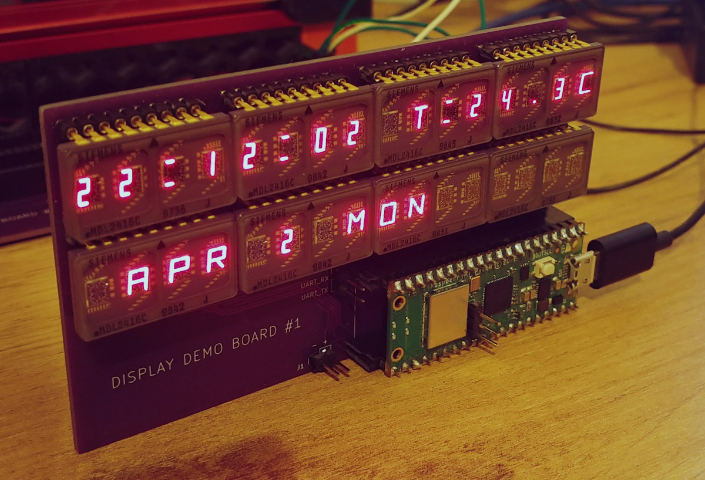

# Vintage display module

An RP2040 based display module using vintage dot-matrix, or 16-segment vintage display ICs.
The end goal is to develop it into a display for 3d-printers and/or CNC machines.


## DemoBoard 1
Simplistic demo-board to evaluate MDL2416C(16-segment LED display), 8 of them are driven by a pico_w. The board just displays current time and date and also prints custom message through a web-interface.


## Building

### Prerequisites 

Generally, refer to the official [Getting started guide](https://datasheets.raspberrypi.com/pico/getting-started-with-pico.pdf)

You'll need to have:

- ARM embedded gcc toolchain
- GDB (gdb-multiarch)
- Pico SDK
- Pico probe
- FreeRTOS
- Pico OpenOCD

The following environment constants should be defined:
```
PICO_SDK_PATH=/* Path to the root of pico-sdk directory */
FREERTOS_KERNEL_PATH=/* Path to the root of FreeRTOS kernel directory */
```

### Configuring and building

```
cd src
mkdir build
cd build
cmake -DPICO_BOARD=pico_w -DCMAKE_BUILD_TYPE=Debug ..

make
```

### Running and debugging

Connect the picoprobe to the target pico_w board according to the "getting started guide", then run the following:

```
cd [Pico OpenOCD source directory]
sudo src/openocd -f interface/picoprobe.cfg -f target/rp2040.cfg -s tcl
```
It should start a GDB server on the default port 3333.

To flash and run/debug the firmware navigate to the project's directory and run the following: 
```
cd build
gdb-multiarch ./display_demo.elf
```
Once GDB started:
```
target remote :3333
load
monitor init reset
cont
```
